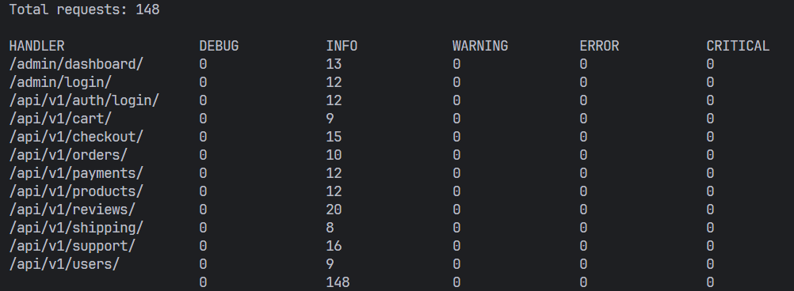

# Log Analyzer для Django-приложения

CLI-приложение для анализа логов Django-приложения и формирования отчетов.

## Функциональность

- Анализ логов Django-приложения
- Формирование отчетов на основе данных из логов
- Поддержка обработки нескольких файлов логов одновременно
- Параллельная обработка файлов для повышения производительности

## Требования

- Python 3.6+
- Стандартная библиотека Python (без внешних зависимостей)

## Установка

Клонируйте репозиторий:

```bash
git clone https://github.com/mkcomru/test_task_workmate
cd test_task_workmate
```

## Использование

### Базовое использование

```bash
python main.py путь/к/логу1.log путь/к/логу2.log --report handlers
```

### Параметры

- `log_files`: один или несколько путей к файлам логов (обязательный параметр)
- `--report`: тип отчета, который нужно сформировать (обязательный параметр)

### Поддерживаемые отчеты

#### handlers

Отчет о состоянии ручек API по каждому уровню логирования.

```bash
python main.py logs/app1.log logs/app2.log logs/app3.log --report handlers
```

Пример вывода:



## Архитектура

Приложение имеет модульную архитектуру, что позволяет легко добавлять новые типы отчетов.

### Компоненты

main.py - точка входа, парсинг аргументов командной строки
log_parser.py - парсер логов Django
report_generator.py - генератор отчетов с поддержкой параллельной обработки
reports/ - модуль с отчетами
base.py - абстрактный базовый класс для всех отчетов
handlers.py - реализация отчета о ручках API

## Добавление нового отчета 

1. Создайте новый класс, наследующийся от BaseReport

2. Реализуйте методы generate() и format_output()

3. Добавьте новый отчет в словарь REPORT_TYPES в классе ReportGenerator

## Тестирование

Для запуска тестов:

```bash
pytest
```

Для проверки покрытия кода тестами:

```bash
pytest --cov=.
```

## Реализация

- Использование только стандартных библиотек Python для основного функционала

- Параллельная обработка файлов через ThreadPoolExecutor

- Модульная структура с возможностью расширения

- Поддержка статической типизации

- Валидация входных параметров и обработка ошибок

- Обработка всех 5 стандартных уровней логирования (DEBUG, INFO, WARNING, ERROR, CRITICAL)
